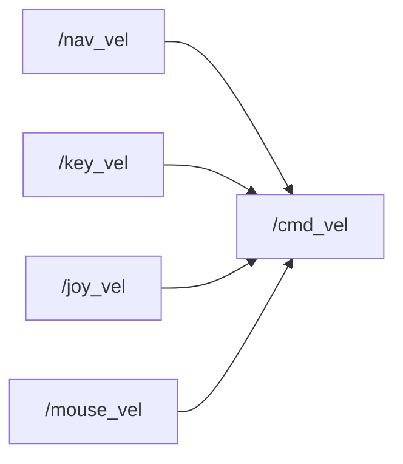
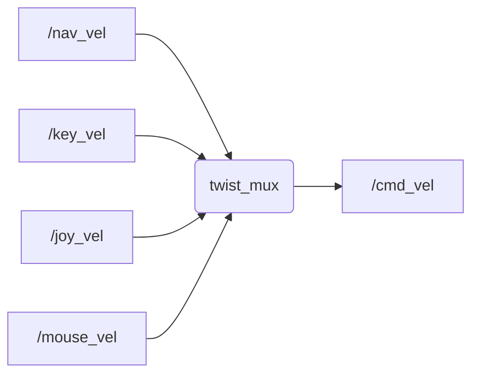

# Control

Outils pour *envoyer* et *gérer* des **commandes en vitesse** à partir du **clavier**, **souris** ou autres.

Les commandes générées sont ensuite utilisées par le `DiffDriveController` pour déplacer le robot.

## Installation

Avant de pouvoir utiliser ce package, il est nécessaire d'installer les packages nécessaires à son fonctionnement :
```sh
$ sudo apt-get install ros-<distro>-teleop-twist-keyboard ros-<distro>-key-teleop ros-<distro>-mouse-teleop ros-<distro>-twist-mux
```

## Utilisation

### Envoyer de commandes :

Pour envoyer des commandes en vitesse, il existe les outils suivants :
- [`teleop_keyboard`](http://wiki.ros.org/teleop_twist_keyboard) : envoi des commandes avec le **clavier** (chaque appuie envoi une commande)
  ```sh
  $ roslaunch robot_control teleop_keyboard.launch
  ```
- [`key_teleop`](http://wiki.ros.org/key_teleop) : envoi *amélioré* des commandes avec le **clavier** (envoi continuellement la commande)
  ```sh
  $ roslaunch robot_control key_teleop.launch
  ```
- [`mouse_teleop`](https://github.com/ros-teleop/teleop_tools/tree/kinetic-devel/mouse_teleop) : envoie des commandes avec la **souris**
  ```sh
  $ roslaunch robot_control mouse_teleop.launch
  ```

### Trier les commandes :

Pour gérer plusieurs sources de commandes (*clavier*, *souris*, `ros_nav`, ...), il est nécessaire d'utiliser un [**multiplexeur**](http://wiki.ros.org/twist_mux) qui permet de garder une seule commande en fonction de *priorités* :
```sh
$ roslaunch robot_control twist_mux.launch
```

**Notes :**
- Utiliser les **launch files** `*_mux.launch` pour démarrer les outils d'envoi de commandes et pour les rediriger vers le *multiplexeur*. 
- Les **launch files** `*_mux.launch` sont configurés pour ne pas envoyer des commandes continuellement, sinon une source serait prioritaire sur les autres alors qu'elle n'est pas utilisée (et enverrait des `Twists` avec des vitesses nulles).
- Les **priorités** sont définies dans [`twist_mux_topics.yaml`](./config/twist_mux_topics.yaml).
- Des **topics** permettent de bloquer certaines commandes, et sont définis dans [`twist_mux_locks.yaml`](./config/twist_mux_locks.yaml) :
  - Type des messages : `std_msgs/Bool` → `true` : bloque, `false` : débloque.
  - `pause_navigation` : bloque les commandes de `nav_vel` (de `ros_nav`).
  - `stop_closing_loop` : bloque toutes les commandes.


## Fonctionnement

Ce package rassemble et configure d'autres packages pour gérer l'envoi de commandes en vitesse sur le topic du `DiffDriveController` : `/robot/controller/base_controller/cmd_vel`.

Packages utilisés : [`teleop_keyboard`](http://wiki.ros.org/teleop_twist_keyboard), [`key_teleop`](http://wiki.ros.org/key_teleop), [`mouse_teleop`](https://github.com/ros-teleop/teleop_tools/tree/kinetic-devel/mouse_teleop), [`twist_mux`](http://wiki.ros.org/twist_mux).


## Schémas

**Sans multiplexeur :**


**Avec multiplexeur :**

