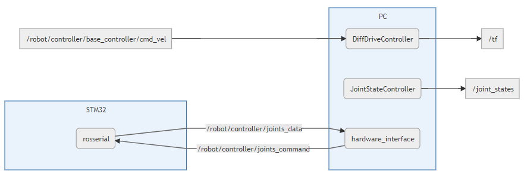

# Hardware Interface

Interface pour faire communiquer la `STM32` avec le `controller` `DiffDriveController`, pour facilement gérer les déplacements du robot.

A partir des informations de *position* et de *vitesse* des roues du robot, le `DiffDriveController` génère l'*odométrie* mais aussi les commandes en vitesse de chaque roue pour qu'une commande en vitesse `/cmd_vel` soit respectée.


## Utilisation

- Démarrer l'`hardware_interface` :
  ```sh
  $ roslaunch robot_hardware robot_hardware.launch
  ```

- Envoyer des commandes en vitesse avec le topic : `/robot/controller/base_controller/cmd_vel`.


## Pour tester sans STM32

- Vérifier dans `hardware.yaml` que `simulate_joints` est activé : `simulate_joints: true`.
- Lancer l'`hardware_interface` : `$ roslaunch robot_hardware robot_hardware.launch`.
- Utiliser `rqt` et le plugin `Robot Tools / Robot Steering` pour envoyer des commandes en vitesse sur le topic `/robot/controller/base_controller/cmd_vel`.
- Ouvrir `RViz` pour observer la `TF` `base_footprint` se déplacer en fonction de la commande (prendre `odom` comme `Fixed Frame`).


## Fonctionnement

L'`hardware_interface` envoie et reçoie des données de la `STM32` grâce à `rosserial`.

Les informations reçues sont stockées dans des `joints` pour être traitées par les `controllers`.

Ces `controllers` peuvent alors renvoyer des commandes en *position* ou en *vitesse*, en fonction d'une commande et de paramètres qui contraignent le déplacement du `joint`.

Liste des `controllers` utilisés :
- `JointStateController` : publie les états des `joints`.
- `DiffDriveController` : `controller` pour robot à roues différentielles.

Détails des éléments dans le *launch file* `robot_hardware.launch` :
- `hardware_interface` : génère les informations de `joints` pour qu'ils puissent intéragir avec les `controllers` (listés dans `hardware.yaml`).
- `controller_manager` : charge les `controllers`.
- `rosserial` : communique avec la `STM32` pour l'utiliser comme un `noeud` qui envoie et reçoie des `topics` et `services`.


## Schéma

Schéma simplifié des `topics` utilisés :

<!--- !!! Pour réutiliser le code : ajouter un tiret '-' à toutes les flèches '->'
```mermaid
graph LR
    %% PC:
    subgraph PC
        NodeState(JointStateController)
        NodeDiff(DiffDriveController)
        NodeHard(hardware_interface)
    end

    NodeHard -- /robot/controller/joints_command -> NodeRossSTM32
    NodeRossSTM32 -- /robot/controller/joints_data -> NodeHard

    %% STM32:
    subgraph STM32
        NodeRossSTM32(rosserial)
    end

    %% Input:
    /robot/controller/base_controller/cmd_vel -> NodeDiff

    %% Outputs:
    NodeDiff -> /tf
    NodeState -> /joint_states
```
-->

## Topics et Services

Liste complète des `topics` et `services` générés et/ou utilisés par les différents éléments :

### Topics :

| Topic                                      | Type                         | Publisher                 | Subscriber                | Commentaire
| ------                                     | ------                       | ------                    | ----                      | ----
| `/robot/controller/base_controller/cmd_vel`| *geometry_msgs/Twist*        |                           | `DiffDriveController`     | Commande en vitesse à réaliser.
| `/robot/controller/joints_data`            | *std_msgs/Float64MultiArray* | `STM32` (par `rosserial`) | `hardware_interface`      | Informations des `joints` (*position*, *vitesse* et *effort* dans une liste : `[p0, v0, e0, p1, ...]`).
| `/robot/controller/joints_command`         | *std_msgs/Float64MultiArray* | `hardware_interface`      | `STM32` (par `rosserial`) | Commandes de tous les `joints` (liste : `[c0, c1, ...]`).
| `/joint_states`                            | *sensor_msgs/JointState*     | `JointStateController`    |                           | Etats des `joints`.
| `/tf`                                      | *tf/tfMessage*               | `DiffDriveController`     |                           | `TFs` des `joints`.
|                                            |                              |                           |                           |
| `/robot/controller/<right_wheel>/command`  | *std_msgs/Float64*           | `hardware_interface`      | | Commande du moteur droit (`<right_wheel>` : `joint` dans `base_controller`).
| `/robot/controller/<left_wheel>/command`   | *std_msgs/Float64*           | `hardware_interface`      | | Commande du moteur droit (`<right_wheel>` : `joint` dans `base_controller`).


### Service :

| Service               | Type                | Serveur              | Commentaire
| ------                | ------              | ------               | ------
| `/robot/write_joints` | *std_srvs/SetBool*  | `hardware_interface` | Modifie le paramètre `write_joints` qui permet d'activer ou désactiver l'envoi des commandes des joints.

  
## Configuration

Paramètres pour configurer le fonctionnement du package :

Dans `controllers.yaml` :
- `state` : `controller` pour publier les état des `joints`
  - `publish_rate` : fréquence de publication.
- `base_controller` : `controller` pour robot à roues différentielles
  - `left_wheel` : nom du `joint` de la roue gauche.
  - `right_wheel` : nom du `joint` de la roue droite.
  - `wheel_separation` : distance entre les roues.
  - `wheel_radius` : rayon d'une roue.
  - `publish_rate` : fréquence de publication de l'*odométrie* et des `TFs`.
  - `base_frame_id` : `frame` parent de l'*odométrie*.
  - `linear` et `angular` : limites sur la commande en vitesse envoyée.

Dans `hardware.yaml` :
- `loop_hz` : fréquence de la boucle principale de l'`hardware_interface`.
- `joints` : liste des `controllers` à charger avec l'`hardware_interface` pour créer les `joints`.
- `simulate_joints` : simule les `joints` comme si les commandes étaient directement réalisées.
- `write_joints` : pour activer/désactiver la publication des commandes des joints (modifiable grâce au service : `/robot/write_joints`).


## Ressources

Liste des ressources utilisées pour réaliser ce package :
- Tutoriel pour créer l'`hardware_interface` : [How to implement ros_control on a custom robot](https://slaterobots.com/blog/5abd8a1ed4442a651de5cb5b/how-to-implement-ros_control-on-a-custom-robot).
- Informations pour utiliser un `controller` : [Tutorial : ROS Control](http://gazebosim.org/tutorials/?tut=ros_control).
- Documentation du [DiffDriveController](http://wiki.ros.org/diff_drive_controller).

Aides :
- Ajouter un `subscriber` dans une classe : [Using Class Methods as Callbacks](http://wiki.ros.org/roscpp_tutorials/Tutorials/UsingClassMethodsAsCallbacks).
- Envoyer une liste de valeurs dans un topic : [Push vector into `MultiArray`-Message and publish it](https://answers.ros.org/question/226726/push-vector-into-multiarray-message-and-publish-it/).
