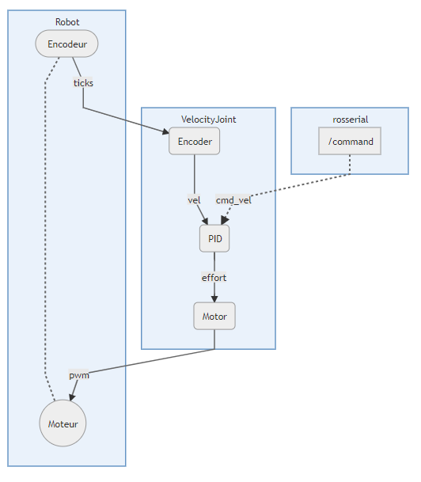
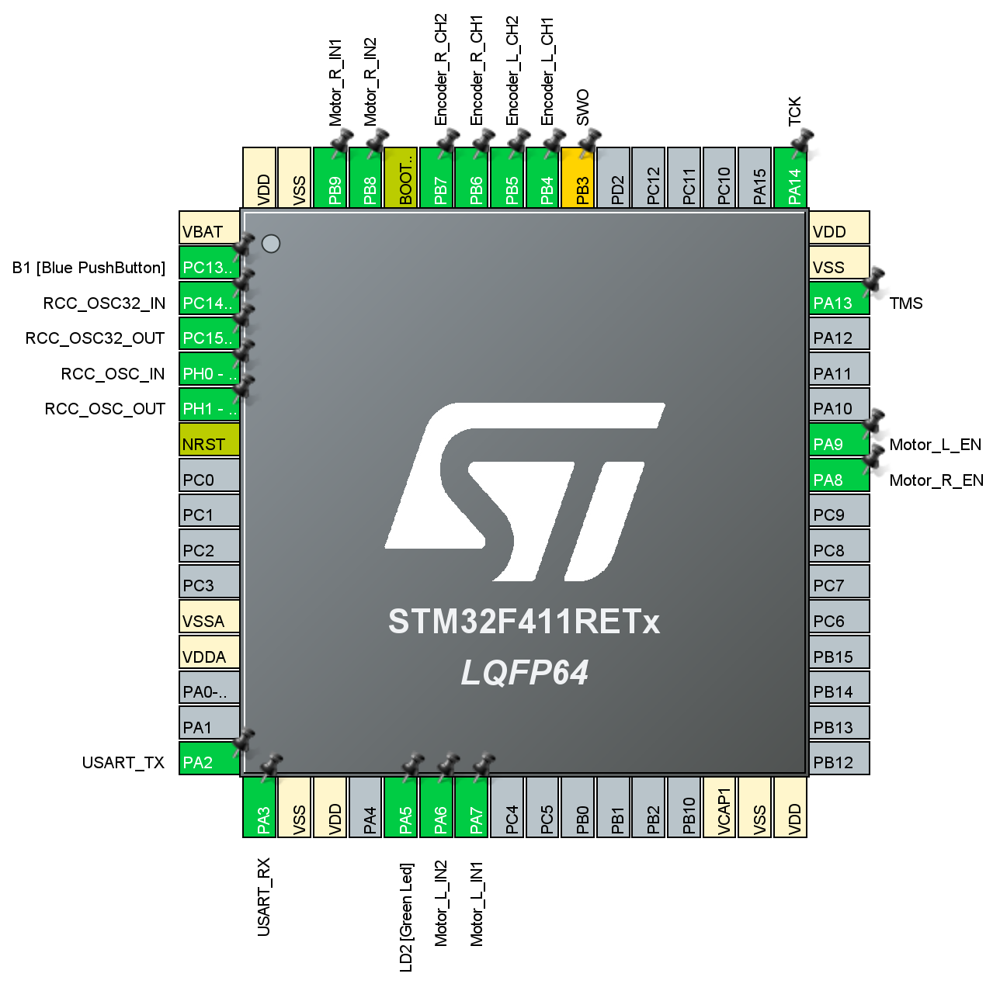
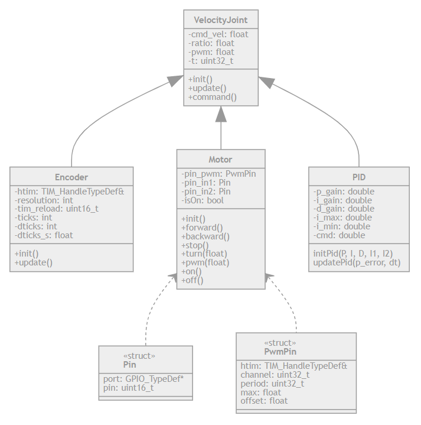
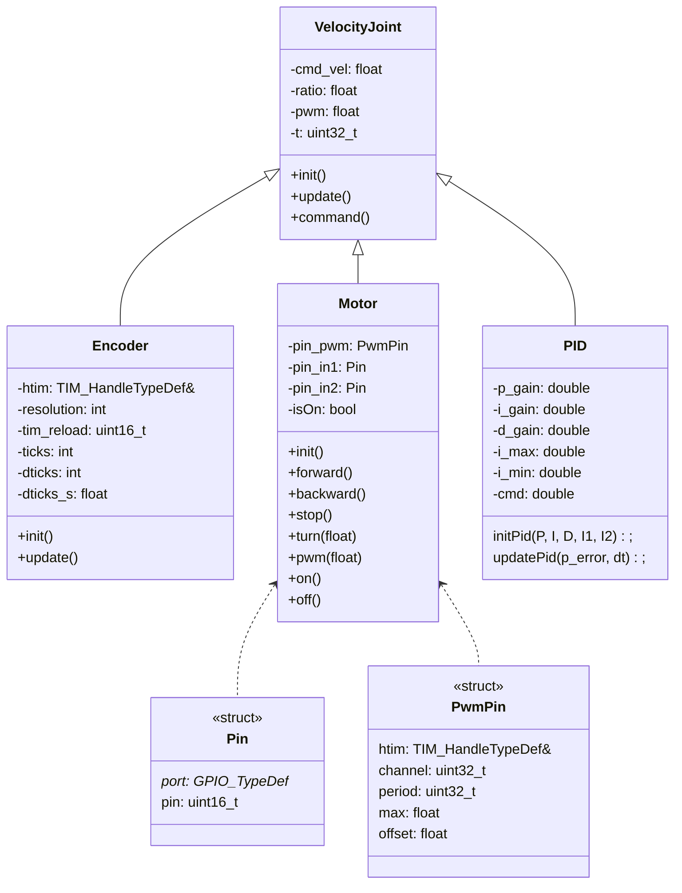

# STM32

Projet `STM32CubeIDE` d'une carte [`NUCLEO-STM32F411RE`](https://www.st.com/en/evaluation-tools/nucleo-f411re.html) pour **contrôler des moteurs en vitesse** grâce à des **encodeurs** et **PID**, à partir de commandes reçus de `topics` de *ROS*.


## Utilisation

Etapes pour contrôler des moteurs avec `ROS` :

**Pour la `STM32` :**
- *Vérifier* que les branchements des *moteurs* et *encodeurs* sur la carte `STM32` correspondent aux valeurs dans le programme.
- *Compiler* et *téléverser* le projet sur la `STM32` à partir de `STM32CubeIDE`.

**Pour `ROS` :**
- Démarrer le `roscore` :
  ```sh
  $ roscore
  ```
- Lancer `rosserial` avec le *port serie* de la `STM32` :
  ```sh
  $ rosrun rosserial_python serial_node.py _port:=/dev/ttyS3 _baud:=115200
  ```
- Utiliser des `topics` pour intéragir avec les éléments branchés sur la `STM32` (avec `<wheel>` remplacer par `wheel_l` ou `wheel_r`) :
  - `Subscribers` pour **contrôler** les *moteurs* :

  |Topic                         | Type | Description
  |------                        |------|-------------
  | `/controller/joints_command` | *std_msgs/Float64MultiArray* | **Commandes en vitesse** pour les *deux moteurs* (`[wheel_l, wheel_r]`).
  | `/<wheel>/command`           | *std_msgs/Float32*           | **Commande en vitesse** que doit respecter le *moteur*.
  | `/<wheel>/on_off`            | *std_msgs/Bool*              | **Active** ou **désactive** le contrôle d'un *moteur*.

  - `Publishers` pour récupérer des **informations** sur les *moteurs* et les *encodeurs* :

  |Topic                      | Type                         | Description
  |------                     |-------                       |-------------
  | `/controller/joints_data` | *std_msgs/Float64MultiArray* | **Informations** sur *chaque moteur* (`[pos, vel, effort]`).
  |                           |                              |
  | `/<wheel>/pos`            | *std_msgs/Float32*           | **Position** du *moteur* (en *radians*).
  | `/<wheel>/vel`            | *std_msgs/Float32*           | **Vitesse** du *moteur* (en *rad/s*).
  | `/<wheel>/pwm`            | *std_msgs/Float32*           | **PWM** envoyée au *moteur*.
  |                           |                              |
  | `/<wheel>/encoder/pos`    | *std_msgs/Float32*           | **Position** de l'*encodeur* (en *radians*).
  | `/<wheel>/encoder/vel`    | *std_msgs/Float32*           | **Vitesse** de l'*encodeur* (en *rad/s*).
  | `/<wheel>/encoder/ticks`  | *std_msgs/Int32*             | **Nombre d'impulsions comptées** de l'*encodeur*.
  | `/<wheel>/encoder/dticks` | *std_msgs/Int32*             | **Nombre d'impulsions comptées** de l'*encodeur* entre deux lectures.

**Bonus :**

- Utiliser `rqt` pour facilement **envoyer** et **visualiser** des `topics` :
  - Ouvrir `rqt` :
  ```sh
  $ rqt
  ```
  - Ajouter le *plugin* `Topics / Message Publisher ` pour **contrôler** les moteurs (en *vitesse*, *on/off*).
  - Ajouter le *plugin* `Visualization / Plot` pour **visualiser** l'évolution de données envoyées par la `STM32` (*position*, *vitesse* d'un *moteur* ou *encodeur*).


## Fonctionnement

La `STM32` contrôle les **moteurs** et récupère leur position grâce à des **encodeurs**.

Un **PID** est alors réalisé pour alimenter les moteurs pour qu'une **consigne en vitesse** soit respectée.

Les classes [`Encoder`](./Core/Inc/robot/Encoder.h), [`Motor`](./Core/Inc/robot/Motor.h) et [`PID`](./Core/Inc/robot/PID.h) sont ainsi rassemblées en une unique classe : [`VelocityJoint`](./Core/Inc/robot/VelocityJoint.h).

Pour gérer la communication avec *ROS* par des `topics`, une implémentation de [`rosserial`](https://github.com/xav-jann1/rosserial_stm32f4) est utilisée, pour faire fonctionner la `STM32` comme un *noeud ROS*.

De plus, d'autres classes ont été réalisées pour gérer l'envoie et la réception de `topics` : [TopicPublisher](./Core/Inc/robot/node/TopicPublisher.h), [TopicSubscriber](./Core/Inc/robot/node/TopicSubscriber.h) qui sont utilisées dans [EncoderWithTopics](./Core/Inc/robot/node/EncoderWithTopics.h), [PIDwithTopics](./Core/Inc/robot/node/PIDwithTopics.h) et [VelocityJointWithTopics](./Core/Inc/robot/node/VelocityJointWithTopics.h).

Schéma simplifié du fontionnement de la `STM32` pour un moteur :

<!--- !!! Pour réutiliser le code : ajouter un tiret '-' à toutes les flèches '->'
```mermaid
    graph TB

    subgraph VelocityJoint
        cEncoder(Encoder) --vel-> cPID(PID) --effort-> cMotor(Motor)
    end

    subgraph Robot
        Encodeur([Encodeur]) -.- Moteur((Moteur)) 
    end

    Encodeur --ticks-> cEncoder
    cMotor --pwm-> Moteur

    subgraph  rosserial
        /command -.cmd_vel.-> cPID
    end
```
-->

## Configuration

Le fichier [robot_config.h](./Core/Inc/robot/config.h) contient la configuration du robot pour correctement paramétrer les *encodeurs*, les *moteurs*, et la communication avec *ROS* :
- Délais de mise à jour des *encodeur* et des *joints*.
- *Timers* des *encodeurs* et des *PWM* des *moteurs*.
- Diamètre des *roue* et *encodeur*.
- Résolution des encodeurs.
- Valeurs des *PIDs* (même si elles peuvent aussi être récupérées du `Parameter Server` de *ROS*).
- Topics pour communiquer avec le `DiffDriveController` de *ROS*.
- Nom des joints

Le reste de la configuration utilise des constantes générées par le `Device Configuration Tool` de `STM32CubeIDE` (en ouvrant le fichier `robot.ioc`) pour faire le lien avec les codes produits par cet outil :
- dans les `User contants` :

  | Constante        | Valeur
  |------------      |---------
  | `CLOCK_FREQ`     | `84000000`
  |                  |
  | `ENCODER_PERIOD` | `0xFFFF`
  | `ENCODER_RELOAD` | `(ENCODER_PERIOD / 2)`
  |                  |
  | `PWM_FREQ`       | `24000`
  | `PWM_PERIOD`     | `(CLOCK_FREQ / PWM_FREQ - 1)`

- par les `User Labels` des `GPIOs`, qui permettent d'obtenir le détail des pins en fonction d'un label :
  

Ces constantes se retrouvent ensuite dans le fichier [`main.h`](./Core/Inc/main.h).


## Configuration Périphériques

Etapes des configurations des périphériques réalisées avec le `Device Configuration Tool` de `STM32CubeIDE` :

- **Encodeur :**
  - Choisir un *timer*.
  - Sélectionner `Encoder Mode` dans `Combined channels`.
  - Remplir `Counter Period` avec la constante `ENCODER_PERIOD` (définit dans `User Constants`).
  - Choisir `Encoder Mode TI1 and TI2` dans `Encoder Mode`.
  - Modifier les *pins* des *channels*, en les choisissant sur l'image du microcontrôleur.
  - Renommer les pins avec les `User Labels` : `ENCODER_W_CH1` et `ENCODER_W_CH2` (avec `W = R ou L`).
  - *Optionnel :* mettre les `GPIOs` en `Pull-Up` ou `Pull-Down`.
- **Motor :**
  - **Configuration PWM :**
    - Choisir un *timer*.
    - Sélectionner `PWM Generation CH_` d'un channel du *timer*.
    - Remplir `Counter Period` avec la constante `PWM_PERIOD` (définit dans `User Constants`).
    - Renommer le pin avec le `User Label` : `ENCODER_W_EN` (avec `W = R ou L`).
    - *Optionnel :* configurer `GPIO` pour que le pin soit `Pull-Down`.
  - **Configurer GPIOs :**
    - Sélectionner `GPIO Output` sur 2 pins.
    - Renommer les pins avec les `User Labels` : `ENCODER_W_IN1` ou `ENCODER_W_IN2` (avec `W = R ou L`).
    - *Optionnel :* mettre en les pins en `Pull-Down`.


## Schéma

**Décomposition des classes :**

<!--- !!! Pour réutiliser le code : ajouter un tiret '-' à toutes les flèches '->'

-->

## Exemples

Des [exemples](./Examples) ont été créés pour expliquer comment utiliser chaque classe :
- [Encoder](./Examples/Encoder_example.cpp) : exemple d'utilisation de la classe [`Encoder`](./Core/Inc/robot/Encoder.h).
- [Motor](./Examples/Motor_example.cpp) : exemple d'utilisation de la classe [`Motor`](./Core/Inc/robot/Motor.h).
- [VelocityJoint](./Examples/VelocityJoint_example.cpp) : exemple d'utilisation de la classe [`VelocityJoint`](./Core/Inc/robot/VelocityJoint.h).
- [rosserial](./Examples/rosserial_example.cpp) : exemple d'utilisation de `rosserial`.
- [VelocityJoint_rosserial](./Examples/VelocityJoint_rosserial_example.cpp) : exemple d'utilisation de la classe [`VelocityJointWithTopics`](./Core/Inc/robot/node/VelocityJointWithTopics.h) avec `rosserial`.
- [joint](./Examples/joint_example.cpp) : exemple pour utiliser un `joint` avec [`VelocityJoint`](./Core/Inc/robot/node/VelocityJointWithTopics.h) et `rosserial`, grâce à des fonctions simplificatrices. 
- [joint avec Systick](./Examples/joint_systick_example.cpp) : identique à l'exemple de `joint`, mais utilise le `Systick` pour déclencher une fonction toutes les *millisecondes*.
- [robot](./Examples/robot_example.cpp) : exemple pour utiliser un *robot à roues différentielles*.

**Pour tester :** ces exemples doivent être *copié-collé* dans [`mainpp.cpp`](./Core/Src/mainpp.cpp).


## Ressources
- Exemples pour [STM32F4](https://github.com/STMicroelectronics/STM32CubeF4).
- Classe [PID](http://docs.ros.org/groovy/api/control_toolbox/html/classcontrol__toolbox_1_1Pid.html) de la *Control Toolbox* de *ROS Groovy*.
- `rosserial` : implémentation sur `STM32` grâce à [`rosserial_stm32f4`](https://github.com/xav-jann1/rosserial_stm32f4).
